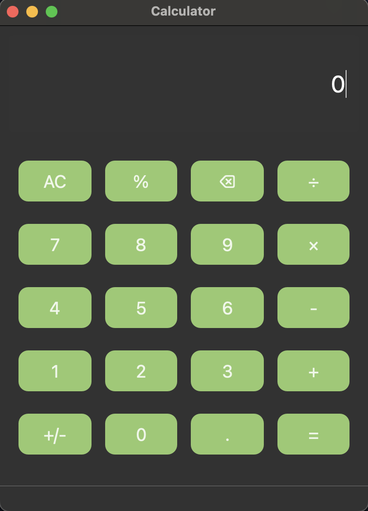

!!THERE MAY BE SOME PROBLEMS WITH COMPARABILITY SO RUN MAIN AS python3.12 main.py!!

Apple-Type Calculator:

This is a fully functioning calculator with a user interface inspired by Apple's design. It supports basic arithmetic operations such as addition, 
subtraction, multiplication, division, and more.

Features:

1. Basic operations: +, -, ×, ÷
2. Percentage calculation (%)
3. Clear and backspace functions
4. Support for decimal numbers and negative numbers

   
Requirements:

1. Python 3.12+
2. PyQt6 library

Screenshots:

